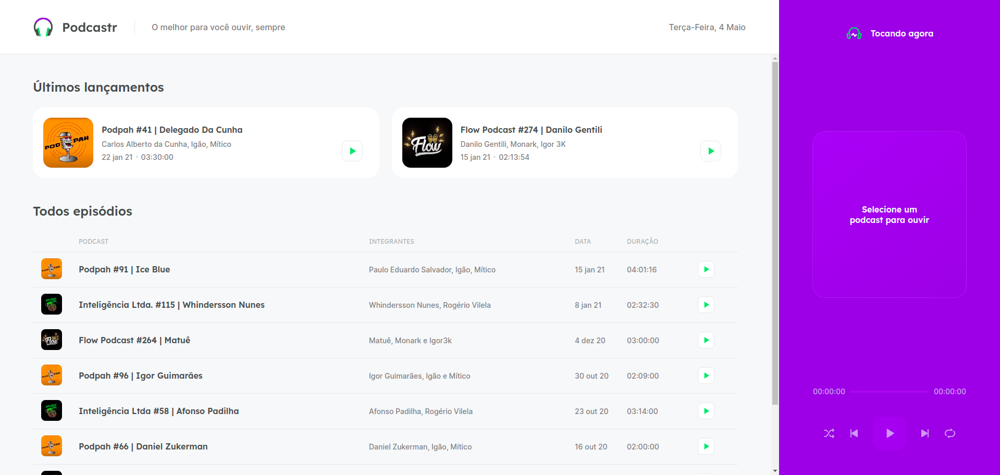
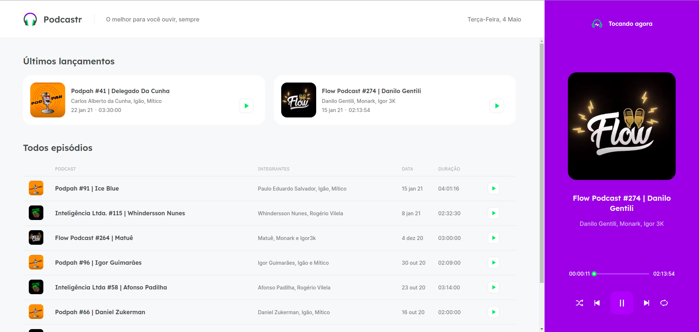
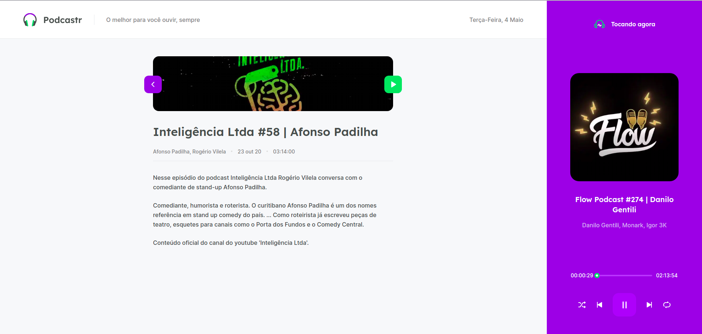
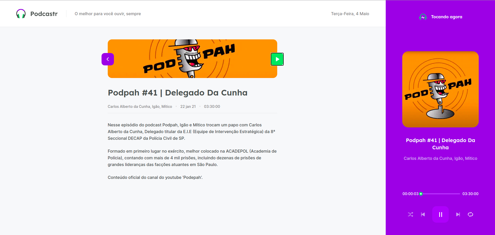

<h2 align="center">
  
</h2>

<p align="center">
  
  
</p>


### :memo: Sobre o projeto
O Podcastr é uma plataforma para voce ouvir seu episódio de podcast preferido, o projeto foi desenvolvido com a tecnologia nextJS um maravilhoso framework para a biblioteca reactJS, também foi desenvolvido com typescript, utilizamos sass como pré-processador de css e uma fakeApi para consumir os conteudos como se fosse dados vindos de uma API. Nessa plataforma foi utilizado diversos conceitos aplicamos o uso de server side rendering, static site generation, contextApi, o uso da tag de html "<audio>" e toda a interação que é possivel ser feita com ela, vale a pena estudar esse projeto e aplicar ainda mais funcionalidades!

### :rocket: Principais tecnologias 
<ul>
  <li><a target="_blank" href="https://nextjs.org/docs/getting-started">NextJS</a></li>
  <li><a target="_blank" href="https://www.typescriptlang.org/docs/">Typescript</a></li>
  <li><a target="_blank" href="https://date-fns.org/">date-fns</a></li>
  <li><a target="_blank" href="https://github.com/sass/sass">Sass</a></li>
  <li><a target="_blank" href="https://github.com/schrodinger/rc-slider">rc-slider</a></li>
  <li><a target="_blank" href="https://github.com/axios/axios">axios</a></li>
</ul>

### :cyclone: Como executar este projeto localmente?
```bash
# Clone este repositório
$ git clone https://github.com/jefferson1104/podcastr-nextJS.git

# Acesse a paste do projeto via terminal
$ cd podcastr-nextjs

# Instale as dependencias do projeto utilizando o gerenciado de pacotes yarn
$ yarn

# Execute o servidor fake
$ yarn server

# Execute o projeto em modo de desenvolvimento
$ yarn dev

```

### :bulb:	 Dicas de melhorias 
- Deixar o projeto responsivo
- Criar um tema dark
- Criar uma versão PWA, dica de pacote para usar [aqui](https://github.com/shadowwalker/next-pwa)
- Utilizar Electron e transformar em um app desktop

### 🎨 Screenshots
<p >
  
  
  
  
</p>


